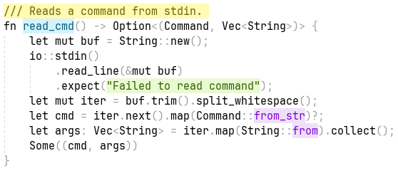

#+title: [ma]thias [c]olor [s]cheme

Clean and simple, and doesn't look a clown threw up on your screen.

#+caption: macs in doom emacs
#+name: doom.png

* Palette

| Element              | Foreground | Background |
|----------------------+------------+------------|
| String               | =#525643=  | =#e2e9c1=  |
| Constant             | =#614c61=  | =#f1ddf1=  |
| Comment              | =#5b5143=  | =#f7e0c3=  |
| Top level definition | =#4c5361=  | =#dde4f2=  |
